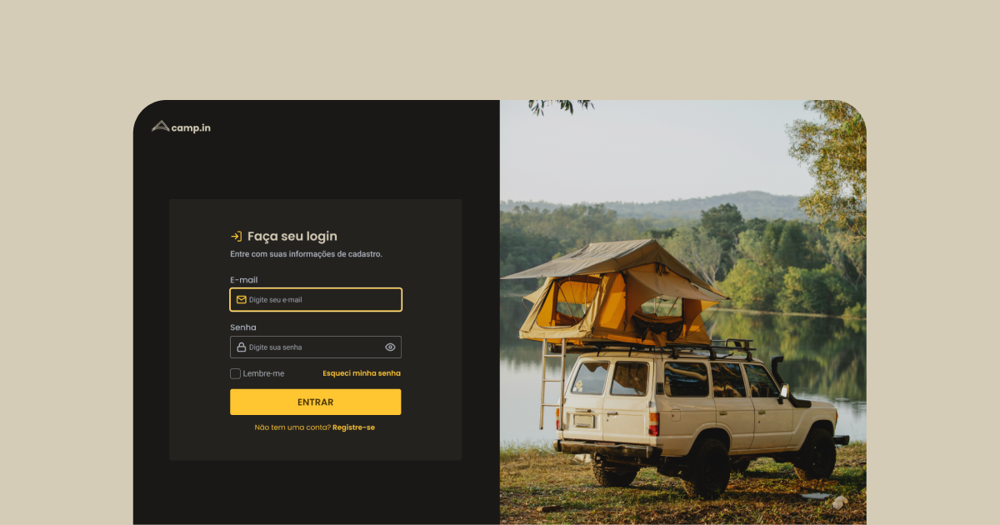

<h1 align="center">Login CSS</h1>

  <a href="#-tecnologias">Tecnologias</a>
  &nbsp;|&nbsp;
  <a href="#-projeto">Projeto</a>
  &nbsp;|&nbsp;
  <a href="#-layout">Layout</a>

  

## 🚀 Tecnologias

Esse projeto foi desenvolvido com as seguintes tecnologias:

- HTML e CSS
- JavaScript
- Git e Github

## 💻 Projeto

Um desafio pratico da <a href="https://www.rocketseat.com.br/?utm_source=google&utm_medium=cpc&utm_campaign=lead&utm_term=perpetuo&utm_content=institucional-lead-home-texto-lead-brandkws-none-none-institucional-none-none-br-google&utm_term=rocketseat&utm_campaign=PROGRAMAS-ALL-BRANDKWS-SEM&utm_source=adwords&utm_medium=ppc&hsa_acc=8545075154&hsa_cam=16048648686&hsa_grp=135825188594&hsa_ad=579096962131&hsa_src=g&hsa_tgt=kwd-679159515078&hsa_kw=rocketseat&hsa_mt=b&hsa_net=adwords&hsa_ver=3&gclid=Cj0KCQjwjt-oBhDKARIsABVRB0xCmSTfXh1MCkB5siq9x5LpzvmJ7dew1zKbpJ_RLJVTgX_tOGn5rS0aAoYFEALw_wcB">Rocketseat</a> que consiste em desenvolver um formulário de login.<a href="https://daniel-csoares.github.io/login-css/"> Você pode acessar o projeto aqui aqui.</a>

---

## 🔖 Layout

Você pode visualizar o layout do projeto através [DESSE LINK](https://www.figma.com/community/file/1241116056018043491). É necessário ter conta no [Figma](https://figma.com) para acessá-lo.

---
